# MVP Engenharia de Dados – ANAC – Histórico de Voos Domésticos (2024)

**Aluno:** Leonardo Cantisano Lins

## 📌 Sumário

- [Objetivo](#objetivo)
- [Problema a ser resolvido](#problema-a-ser-resolvido)
- [Perguntas de Negócio](#perguntas-de-negócio)
- [Arquitetura da Solução](#arquitetura-da-solução)
- [Coleta dos Dados](#coleta-dos-dados)
- [Modelagem de Dados](#modelagem-de-dados)
- [Camada Bronze](#camada-bronze--dados-brutos)
- [Camada Silver](#camada-silver--dados-tratados-e-enriquecidos)
- [Construção manual da base de companhias aéreas](#construção-manual-da-base-de-companhias-aéreas)
- [Camada Gold](#camada-gold--visão-analítica-consolidada)
- [Catálogo de Dados](#catálogo-de-dados)
- [Qualidade dos dados](#qualidade-dos-dados)
- [Resultados das Perguntas de Negócio](#resultados-das-perguntas-de-negócio)
- [Autoavaliação](#autoavaliação)

## Objetivo
O objetivo deste MVP é construir um pipeline de dados completo em nuvem utilizando Databricks, desde ingestão, transformação, modelagem e análise, permitindo responder perguntas de negócio relacionadas ao comportamento do histórico de voos domésticos no Brasil ao longo do ano de 2024.

## Problema a ser resolvido
O setor aéreo é influenciado por diversos fatores, como sazonalidade, geografia, demanda e capacidade operacional. O objetivo deste MVP é avaliar o comportamento dos voos domésticos no Brasil em 2024, identificando padrões operacionais, sazonalidade e concentração do mercado.

Ao responder as perguntas de negócio abaixo, será possível compreender:

• onde o setor aéreo é mais intenso;

• quais aeroportos concentram maior atividade;

• quais rotas são mais movimentadas;

• quais empresas dominam o mercado; e

• como evoluiu o fluxo de transporte ao longo do ano.

## Perguntas de Negócio

### Volume e malha aérea
1. Quantos voos domésticos foram realizados por mês em 2024?
2. Quais aeroportos concentraram o maior volume de partidas?
3. Quais aeroportos concentraram o maior volume de chegadas?
4. Qual a participação percentual dos 10 maiores aeroportos no total de voos?

### Sazonalidade
5. Como o volume mensal de voos variou ao longo do ano?
6. Quais estações do ano apresentam maior e menor movimento aéreo?

### Conectividade
7. Quais pares origem–destino tiveram maior volume de voos?
8. Quais cidades apresentam maior diversidade de destinos atendidos?

### Companhias aéreas
9. Quais companhias aéreas operaram o maior número de voos domésticos?
10. Existe concentração da operação em poucas companhias?

---

## Arquitetura da Solução

### Processamento:
O pipeline foi construído seguindo o modelo Bronze → Silver → Gold:

• Bronze: ingestão dos arquivos CSV, padronização de colunas e armazenamento inicial em Delta;

• Silver: tratamento e enriquecimento dos dados (conversão de datas, remoção de voos internacionais, normalização e derivação de colunas temporais); e

• Gold: consolidação final em uma tabela analítica única (voos_flat), integrando informações de voos, aeroportos e companhias.

### Tecnologias e Bibliotecas:

• Databricks  

• PySpark (SQL + DataFrames)

• pyspark.sql.functions / pyspark.sql.types

• Consultas SQL  

### Armazenamento:
Delta Lake

### Fonte dos dados:
Agência Nacional de Aviação Civil (ANAC)

---

## Coleta dos Dados
Para compor o MVP, foram utilizadas duas bases públicas disponibilizadas pela ANAC (Agência Nacional de Aviação Civil) que contém o histórico de voos realizados no Brasil e os dados sobre os aeroportos públicos registrados no país. O primeiro dataset contém informações detalhadas de voos domésticos e internacionais, incluindo identificação da companhia aérea, aeroportos de origem e destino, horários e status de operação enquanto o segundo traz os principais dados operacionais e geográficos dos aeroportos brasileiros.

A extração dos dados foi feita manualmente a partir dos arquivos CSV disponibilizados no portal de dados da ANAC, eliminando a necessidade de web scraping. Os arquivos originais foram armazenados localmente e posteriormente enviados para o ambiente Databricks como arquivos fonte para o Data Lake.

Link para obtenção dos dados: https://www.gov.br/anac/pt-br/assuntos/dados-e-estatisticas

---

## Modelagem de Dados
O projeto foi construído seguindo a arquitetura medalhão com três camadas — Bronze, Silver e Gold — para garantir governança, rastreabilidade e organização analítica. Foi feita a opção por modelagem flat na camada Gold por ser mais alinhada ao paradigma de Data Lake e ao objetivo exploratório do MVP. O modelo reduz complexidade, elimina necessidade de múltiplos join operacionais e entrega excelente eficiência analítica com baixo custo computacional.

---

## Camada Bronze – dados brutos

Nesta camada foram armazenados os arquivos exatamente como fornecidos pela ANAC. Realizamos apenas as transformações nos nomes das colunas possibilitando a criação das tabelas em formato Delta, conforme evidência abaixo:

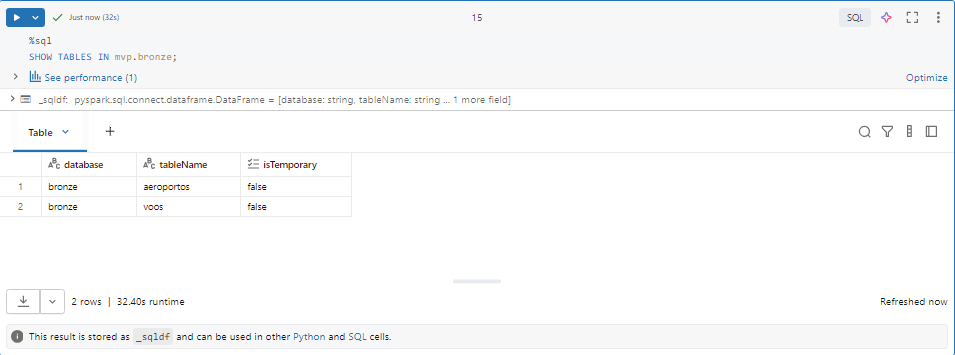

---

## Camada Silver – dados tratados e enriquecidos

Nesta camada foram aplicadas transformações estruturais e de padronização, utilizando Pyspark e consultas SQL para validação de integridade, incluindo:

• conversão de datas/horas do formato string para formato timestamp;

• filtragem para manter apenas voos domésticos, aeroportos em atividade e com UF definido;

• criação de flag de "voo realizado"; e

• seleção de colunas analíticas relevantes.

Além disso, foram adicionadas novas colunas, que permitiram análises temporais sem necessidade de retrabalho na camada gold. São elas, evidenciadas com a imagem abaixo:

• ano do voo;

• mês do voo; e

• estação do ano.

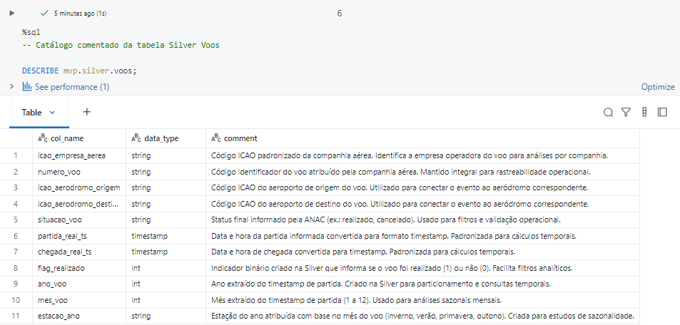

Nesta camada, foram realizadas:

• Checagem de nulos;

• Checagem de consistência dos códigos ICAO;

• Checagem dos dados de aeroportos; e

• Checagem das timestamps do histórico de voos.

Além disso, foram mantidos todos os registros de voos domésticos de passageiros, independentemente de sua situação operacional, de forma a preservar o histórico completo do fenômeno estudado.

Estas transformações garantiram a integridade necessária para as análises.

---

## Construção manual da base de companhias aéreas

Devido a não existência de uma base estruturada pública de companhias que relaciona o código ICAO com o nome comercial da empresa aérea, foi criada uma tabela, na Camada Silver, contendo apenas os dados das companhias que haviam realizado voos domésticos em 2024 conforme consulta prévia, trazendo os seguintes dados:

• código ICAO;

• nome da companhia;

• tipo de operação; e

• flag ativo para análise.

Essa decisão reduziu inconsistências e eliminou a dependência de fontes terceiras de baixa confiabilidade.

---

## Camada Gold – visão analítica consolidada

A camada Gold resultou em uma tabela flat criada com SQL, consolidando, em um único dataset:

• voos;

• aeroportos de origem com dados detalhados;

• aeroportos de destino com dados detalhados; e

• companhias aéreas com dados detalhados.

A tabela mvp.gold.voos_flat contém aproximadamente 800 mil linhas de voos domésticos processados (realizados, cancelados ou não informados), cobrindo todos os meses de 2024, conforme evidência abaixo:

Essa estrutura permite responder todas as perguntas de negócio diretamente com consultas SQL dentro do Databricks.

Embora a tabela contenha voos realizados e cancelados, as análises foram conduzidas com foco exclusivo nos voos domésticos realizados, aplicando filtros por status em nível de consulta. Essa decisão mantém a integridade histórica dos dados na camada Gold e garante flexibilidade para análises futuras sem a necessidade de reconstrução da tabela.

---

## Catálogo de Dados

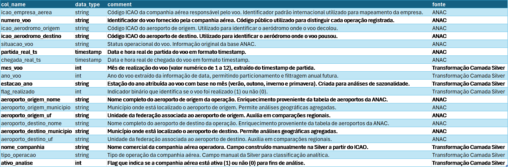

---

## Qualidade dos dados
A base utilizada apresentou estrutura sólida, organizada e consistente, proveniente diretamente das fontes oficiais da ANAC, garantindo confiabilidade ao processo analítico.

Durante o desenvolvimento das camadas Bronze → Silver → Gold, não houve perda de registros relevantes no histórico de voos, exceto a exclusão proposital de voos internacionais por alinhamento ao escopo do projeto, focado apenas em operações domésticas.

As transformações aplicadas foram mínimas e pontuais, envolvendo apenas:

• padronização e renomeação de colunas para adequação ao formato Delta, e;

• conversão dos campos de data e hora de string para timestamp, garantindo melhor capacidade de consulta e ordenação temporal.

Como ponto de melhoria identificado, destaca-se a ausência de uma base nacional estruturada de companhias aéreas com nomes comerciais referenciados por ICAO. Essa lacuna demandou a criação manual de uma tabela auxiliar para enriquecer as análises e compor a camada Gold.

A base de aeroportos mostrou-se robusta e com excelente cobertura geográfica, havendo perda irrelevante de registros de aeroportos menores, decorrente da falta de UF e município, sem impacto para o conjunto analítico.

Os joins executados consolidaram o dataset em uma tabela flat completa e confiável, permitindo responder a todas as perguntas de negócio propostas e abrindo possibilidade para futuras expansões analíticas com integração de novos dados e períodos.

---

## Resultados das Perguntas de Negócio

### 1. Quantos voos domésticos foram realizados por mês em 2024?

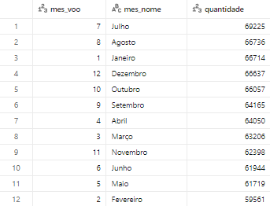

Julho foi o mês com o maior volume de voos domésticos em 2024 (aprox. 69 mil voos), indicando forte influência do período de férias escolares e alta demanda turística no país.

Por outro lado, fevereiro apresentou o menor volume (aprox. 59 mil voos), alinhando-se ao contexto de fim das férias e retomada do ano letivo, o que historicamente reduz o fluxo de viagens.

Essa variação evidencia um padrão sazonal consistente no setor ao longo do ano.

---

### 2. Quais aeroportos concentraram o maior volume de partidas?

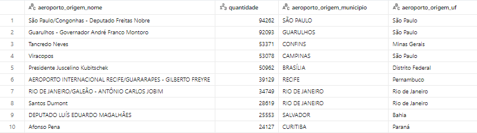

A análise demonstra que o volume de partidas domésticas é altamente concentrado no Sudeste, especialmente no estado de São Paulo, que abriga 3 dos 4 maiores aeroportos do país. Essa concentração sugere que os principais fluxos operacionais estão associados a grandes centros econômicos e urbanos da região Sudeste do país.

---

### 3. Quais aeroportos concentraram o maior volume de chegadas?

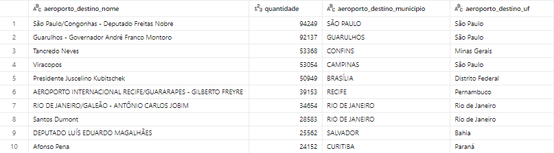

Chegadas e partidas apresentam um mesmo padrão de domínio operacional concentrado no Sudeste, liderado por São Paulo. Essa simetria confirma regularidade de fluxo e estabilidade da malha aérea doméstica ao longo de 2024

---

### 4. Qual a participação percentual dos 10 maiores aeroportos no total de voos?

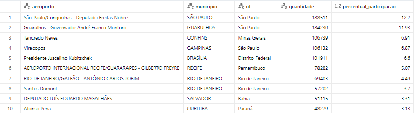

Os 10 aeroportos com maior volume de voos representam, juntos, aproximadamente 64,23% de toda a movimentação aérea registrada no período analisado.

Essa concentração indica que mais da metade do fluxo nacional de voos está distribuída entre um número reduzido de aeroportos, reforçando a centralização operacional do sistema aéreo brasileiro nas principais capitais e hubs regionais.

---

### 5. Como o volume mensal de voos variou ao longo do ano?

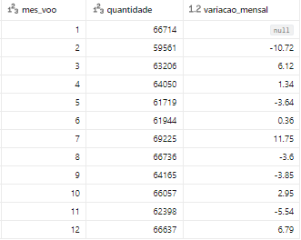

O volume mensal apresentou oscilações ao longo do ano, com queda significativa em fevereiro, seguida de recuperação progressiva até atingir o pico em julho. Após esse mês, o volume recuou levemente e encerrou o ano em patamar semelhante ao observado em janeiro.

---

### 6. Quais estações do ano apresentam maior e menor movimento aéreo?

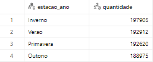

O inverno apresentou o maior volume de voos no ano, seguido por verão e primavera, evidenciando alta demanda no meio do ano. O outono registrou o menor movimento aéreo entre as estações analisadas.

---

### 7. Quais pares origem–destino tiveram maior volume de voos?

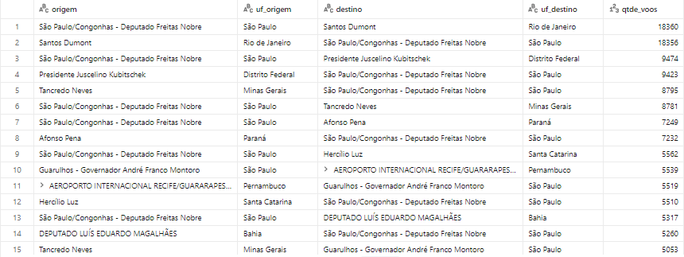

As rotas com maior volume conectam São Paulo/Congonhas ↔ Rio de Janeiro/Santos Dumont, refletindo a forte integração econômica entre os dois principais centros financeiros e corporativos do país. Na sequência aparecem ligações entre São Paulo e Brasília/Confins/Curitiba, reforçando o papel de São Paulo como hub nacional e mostrando que o tráfego aéreo se concentra em fluxos que unem núcleos de decisão política (Brasília), regiões industriais consolidadas (Minas Gerais) e polos urbanos de alta densidade econômica (Sul e Sudeste).

---

### 8. Quais cidades apresentam maior diversidade de destinos atendidos?

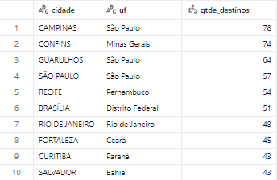

Campinas, Confins, Guarulhos e Congonhas lideram em diversidade de destinos, reforçando o peso econômico do Sudeste como principal centro de conexões aéreas do país.

Campinas lidera em diversidade de destinos sobretudo pelo perfil do Aeroporto de Viracopos, que funciona como principal hub operacional da Azul Linhas Aéreas. Essa concentração de voos distribuídos para cidades de médio porte e rotas regionais expande significativamente a malha de conexões partindo da cidade.

Recife, Fortaleza e Salvador se destacam como polos turísticos e regionais no Nordeste, enquanto Brasília e Rio de Janeiro mantêm ampla malha por sua relevância política e populacional.

Esse padrão mostra que a diversidade de rotas está concentrada em grandes centros urbanos com forte demanda nacional.

---

### 9. Quais companhias aéreas operaram o maior número de voos domésticos?

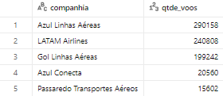

A Azul Linhas Aéreas liderou o volume de voos domésticos em 2024, seguida pela LATAM Airlines e pela Gol Linhas Aéreas. Juntas, essas três companhias formam o núcleo da aviação doméstica brasileira, movimentando a maior parte dos trajetos entre capitais e cidades regionais.

---

### 10. Existe concentração da operação em poucas companhias?

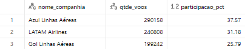

Sim. Os dados mostram forte concentração do mercado doméstico em 2024: três companhias — Azul, LATAM e Gol — somam aproximadamente 94% de todos os voos realizados no país.

Esse cenário confirma um setor altamente concentrado, onde poucas empresas dominam a malha aérea nacional, influenciando preços, disponibilidade de rotas e competitividade.

---

## Autoavaliação

Este projeto foi o meu primeiro MVP dentro da pós-graduação, representando também um passo importante na minha transição de carreira. Como este foi o meu primeiro módulo e meu primeiro contato direto com linguagens de programação aplicadas ao ambiente Databricks, foi necessário superar uma curva inicial de aprendizado — especialmente em relação ao funcionamento da plataforma, ao uso do PySpark e ao desenvolvimento de consultas em SQL distribuído.

Ao longo do projeto, consegui consolidar rapidamente o entendimento sobre os conceitos apresentados e evoluí minha autonomia dentro do Databricks, desde a ingestão até a modelagem e construção da camada Gold.
Avalio que essa evolução foi refletida na entrega final: um pipeline robusto, documentado e capaz de responder a todas as perguntas de negócio propostas, demonstrando capacidade de organização, aprendizado prático e adaptação técnica.

Reconheço também alguns pontos de melhoria natural nesta etapa do meu desenvolvimento. Entre eles, o aprofundamento no PySpark, especialmente para construção de visualizações e manipulação de dados em escala mais avançada, o que permitirá explorar resultados de maneira ainda mais clara e intuitiva.

Além disso, vejo oportunidades futuras para evolução do projeto, como:

• ampliação da análise histórica, incorporando dados de anos anteriores,

• inclusão de voos internacionais para comparação de malha e sazonalidade

